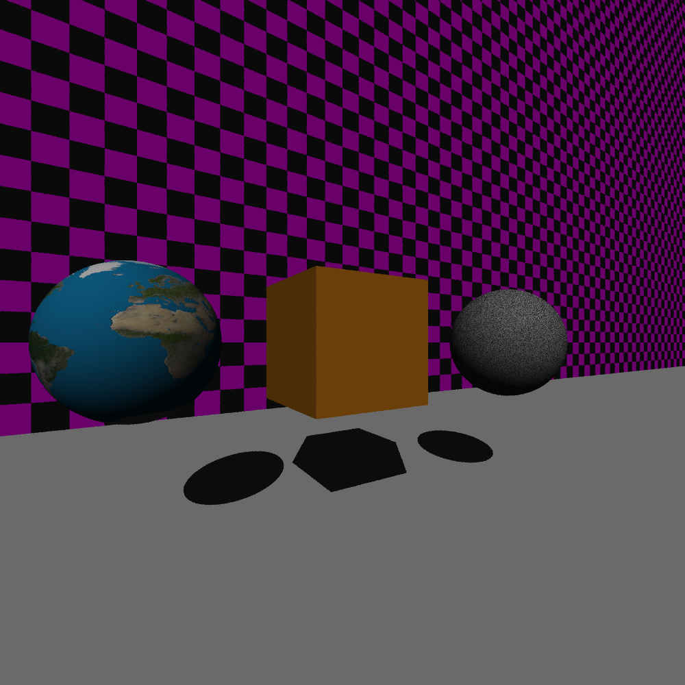

# rayTracer

## Description 
The following program files create a ray tracer. 

"ray tracing is a rendering technique for generating an image by tracing the path of light as pixels in an image plane and simulating the effects of its encounters with virtual objects." - Wikipedia. 

## Installation
To run the program, download the files and generate the build folder with CMake and the CMake file. To run program yourself you need CMake, python, C++.

## Development
This ray tracer was built from the ground up. It features specular reflection, diffuse reflection, mesh mapping, texture mapping, shadows, point/directional lighting and multi-sampling techniques. An example image is shown on the right. Below is an example image with one point light. 

